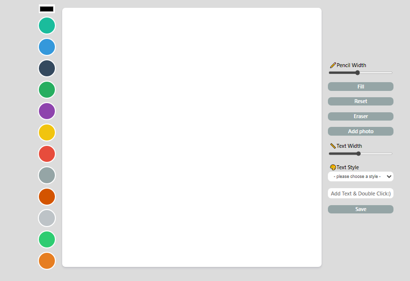

# MEME-MAKER
:point_right:그림판

:clapper: 데모앱: [meme-maker](https://meme-maker-std.netlify.app/)
## :memo:기능
+ 유저가 pencil-width를 선택해 캔버스에 그림을 그릴 수 있다.
+ Fill버튼을 누르면 캔버스 전체를 원하는 색상으로 채울 수 있다.
+ Draw버튼을 누르면 다시 pencil로 꾸밀 수 있다.
+ 폰트 크기, 색상과 스타일을 선택한 후 텍스트를 입력하고 더블클릭하면 원하는 위치에 텍스트를 출력할 수 있다.
+ Reset >> 전체 삭제기능
+ Eraser >> 지우개 기능
+ 사진업로드 기능
+ 저장 기능

## :hammer:사용한 기술
+ HTML
+ CSS
+ Vanila Javascript
